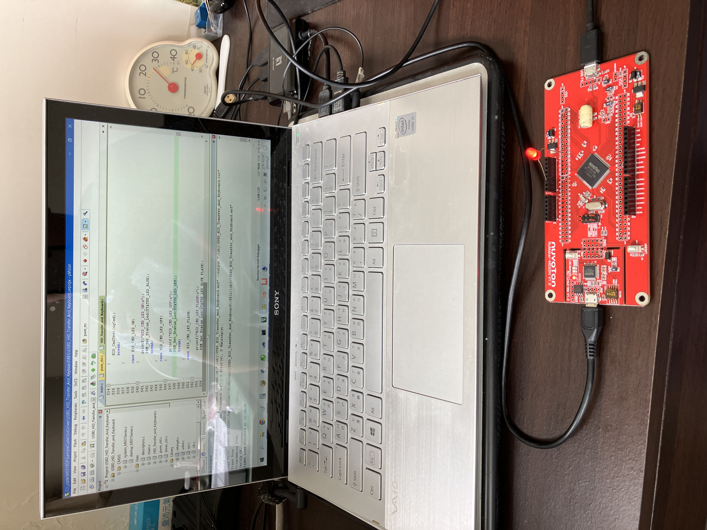
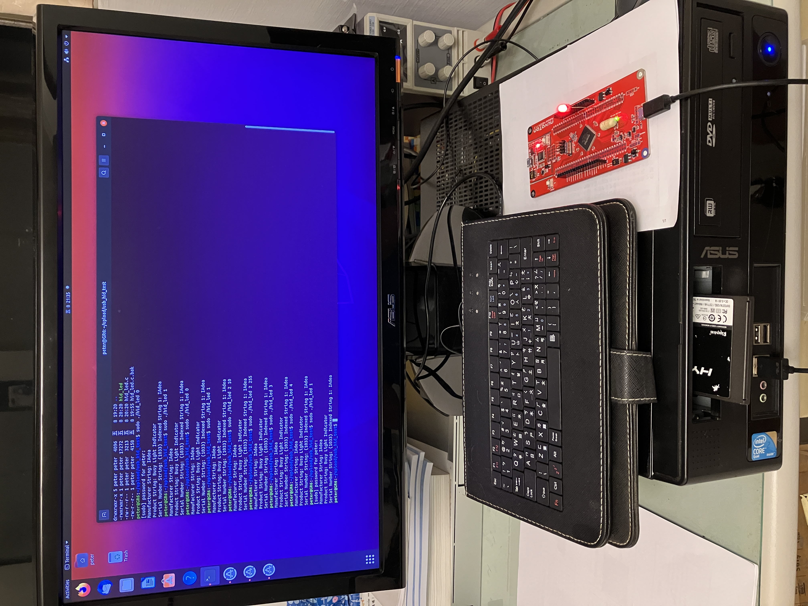

***

# Install Keil 
[link](https://www2.keil.com/mdk5)

# Install Nu-Link_Keil_Driver
[link](https://www.nuvoton.com/tool-and-software/ide-and-compiler/)

# Install Visual Studio 2010
[link](https://learn.microsoft.com/zh-tw/visualstudio/releasenotes/vs2010-sp1-vs)

# Clone code and submodule
`git clone https://github.com/eiffelpeter/USBD_HID_Transfer.git --recurse-submodules`

# Open project file to build 
Open `USBD_HID_Transfer.uvprojx` by Keil.

Open `HIDTransferTest.sln` by visual studio.

# Demo on windows

# Demo on ubuntu

