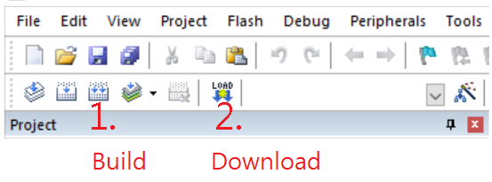

***

# Install Keil 
[link](https://www2.keil.com/mdk5)

# Install Nu-Link_Keil_Driver
[link](https://www.nuvoton.com/tool-and-software/ide-and-compiler/)

## Open USBD_HID_Transfer.uvprojx in keil, build and download

